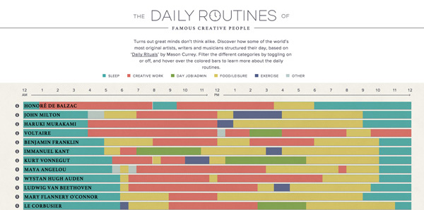
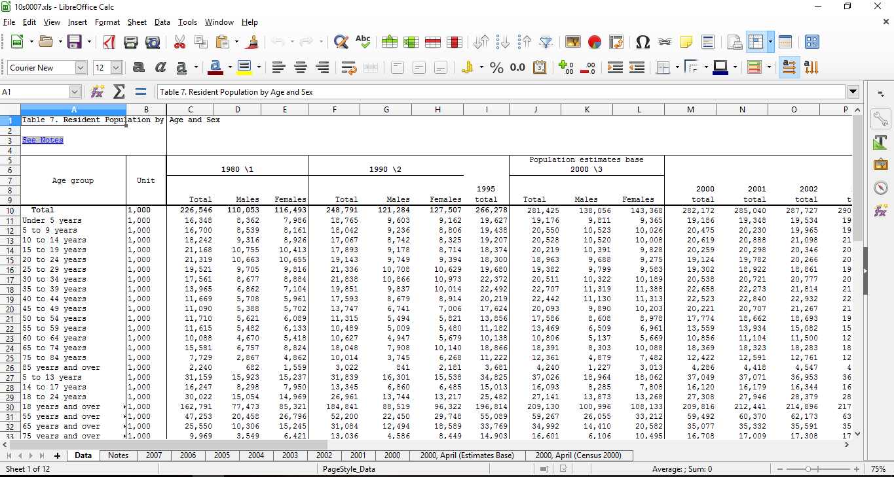
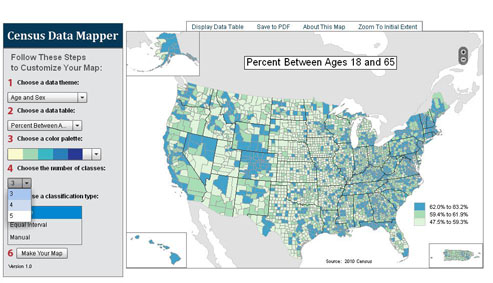
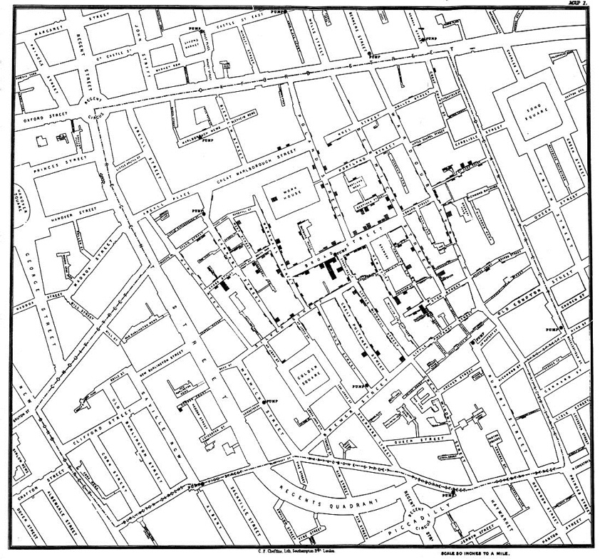
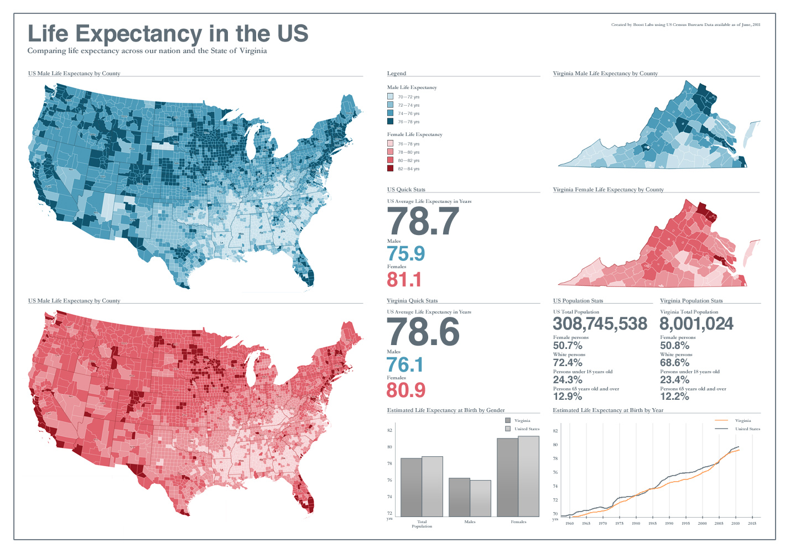
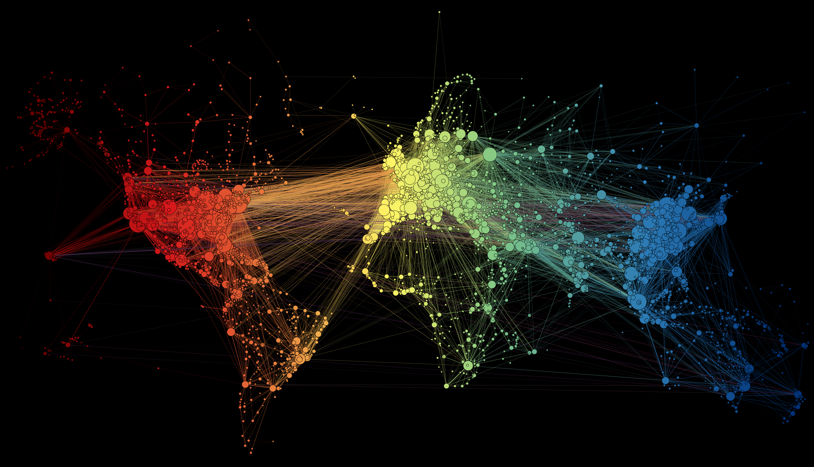

% Data Visualization
% Kelsey Hammer & Ellen Cline
% 05 December, 2016

# What is data visualization?
<section id="my-slide" class="slide level1" data-audio-src="a6.ogg"></section>

<aside class="notes">
Data visualization is all about conveying engaging and vital data through concise and creative design practices. 
It combines the disciplines of statistics, graphics and graphical design, and computer science.
Data visualization can take many forms through many types of technologies, but good data visualization is about telling the best story, 
in the right format, with the least amount of excess. 
For example, here we have a colorful, interactive representation of the daily schedules of famous writers and artists. 
</aside>

# Why do we care?

<aside class="notes">
All presentations, be they scholarly or not, seek to convey some form of information to the audience. 
A good presenter can hold a listener's attention with inflections in their voice, shared anecdotes, and a well formatted speech or slides.
A great presenter tells a story, and knows that the medium he or she uses to share that story will affect its delivery and overall success.
Data visualization takes common datasets or statistics and puts them together in an aethetically appealing, informative way.
Anyone familiar with spreadsheet software like Excel is probably used to long rows of miniscule characters and data points, as shown on the left.
On the right, we have a similar dataset. While it may not show all the data listed in the excel spreadsheet on the left,
it is more visual, is interactive, and generally does a better job of informing the audience.
</aside>

# History & Evolution
Is data visualization new? How has it changed over the years?

<aside class="notes">
Here we see an example of data visualization from the 1800s. This is John Snow's map of cholera cases in London, all of which he was able to 
trace back to one infected water pump in the neighborhood.
This is not a new field, although the tools used within in it and the applications it has for scholars, libraries, and ordinary citizens have changed over the years. 
Early map-makers and visual artists, even cave painters, were using visuals to convey valuable information to others. 
In the 17th century, scholars like Galileo, measured time, distance, and space to map the stars and solve complex problems.  
The 19th century marked the beginning of modern graphics, with creators experimenting with new styles like bar and pie charts, line graphs, and atlases. 
The 19th century was considered a Golden Age of data visualization with innovative and successful styles being created and used by data visualizers from many disciplines. 
The 20th century began as a time of uniformity for data visualization, rather than a time of risk taking and innovation. 
However, today data visualization is booming again with an onslaught of design and technology innovations encouraging new trends and techniques in the field. 
Whereas data in meetings and ideas in classrooms may have once been perceived as boring or tedious, colorful pictures and maps spark interest in this type of information and help further comprehension. 
Now that data visualization is better understood, we may look at some tools/examples of the process. 
</aside>

# Tools

Where do data scientists start?
Find/Generate Data -> Analyze -> Visualize -> Curate/Store
Helpful Tools:

<aside class="notes">
Here are some tools.
For the purposes of this presentation, we have chosen to focus mostly on examples centered around data visualization and geography. 
We'll talk about tools you can use to make your own graphs or maps or what-have-you, but please be aware that this is a field that has many
hundreds of applications not at all limited to geography. 
<\aside>

# Good Examples

<aside class="notes">
What does a good data visualization look like?
</aside>

# Bad Examples

<aside class="notes">
What does a bad data visualization look like?
</aside>

# The Future?
Where are we headed?

<aside class="notes">
What is the future of data viz?
</aside>

# Data Viz at UNC!

<aside class="notes">
Interested in Data Viz now? Want to know about the cool stuff we have here at UNC?
UNC-Chapel Hill has many resources available to help with Data Visualization. Davis Library houses the Research Hub. 
The Research Hub offers help with research presentation and GIS, and is home to several geography, GIS, and data visualization librarians.
The Undergraduate Library is home to the Design Lab which offers design classes, consultation, and equipment -- some specifically for data visualization. 
UNC-Chapel Hill also have access to Lynda.Com, a website with thousands of tutorials for technology, design, and other practical skills - including data visualization 
and software like InDesign, Photoshop, and Illustrator which you might use to build your data visualizations. 
</aside>